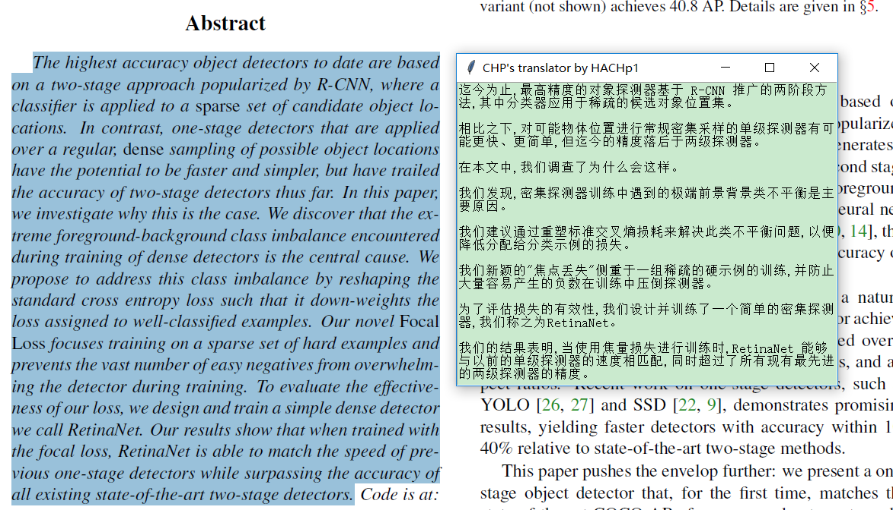

# chptrans

## 功能

* 弹窗翻译pdf英文论文用的小工具，避免换行符的尴尬，免去打开浏览器的过程，翻译只需三个键，妈妈再也不用担心我看论文原文了:)
* **使用Bing接口，感谢Bing提供的接口**

## 环境

* 支持Win/MAC/ubuntu，python3

## 安装方法

* 安装前请使用pip安装keyboard、brotli、xerox、pyautogui以及requests库：

``` 
pip install -i https://pypi.tuna.tsinghua.edu.cn/simple keyboard brotli xerox pyautogui requests
```

* 安装：

``` 
python setup.py build
python setup.py install
```

## 用法

* 安装好后，在命令行中输入`chptrans`打开翻译器，复制想翻译的英文（ctrl+c)，复制完后按f键翻译（翻译器会将剪切板中的内容翻译为中文）。
* 按`ctrl+e`可以切换中英对照模式。
* 按`ctrl+r`可以切换翻译器。

## 使用截图

普通模式：



中英对照模式：


## 更新日志

* 2019.5.15 百度接口失效，改用Bing接口。
* 2019.6.25 Bing接口更新，加入firefox头部和brotli解码。
* 2019.7.16 Bing接口更新，改用Bing接口V3。
* 2019.8.4 程序功能更新，直接使用弹窗和按键，操作方便快捷。
* 2019.8.12 增加对复制文件等异常情况的处理
* 2019.9.20 换行处部分处理
* 2020.2.27 修正了一处异常处理
* 2021.4.19 兼容Windows、MAC和ubuntu，新增中英对照模式
* 2021.4.30 新增翻译器切换，同时支持Bing和有道翻译

## todo

* ~~按键关闭翻译窗口~~（感觉不如直接用鼠标点叉叉）
* ~~新窗口连续翻译~~（太麻烦了，不够简洁）
